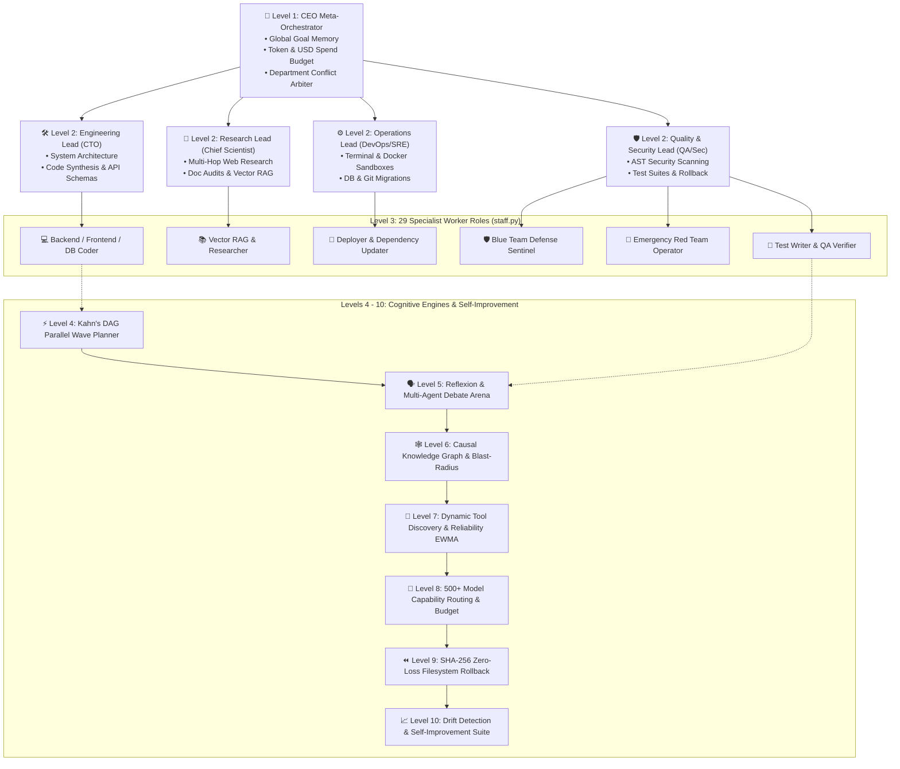

# Universal Agent HP

[](https://github.com/kapitan00000978-sketch/Universal-Agent-HP/actions/workflows/tests.yml)
[](https://opensource.org/licenses/MIT)
[](https://www.python.org/downloads/)
[](#architecture-genesis-10-level-cognitive-swarm-hierarchy-levels-1---10)
[](#testing--security)

Universal Agent HP is an AI agent framework for software engineering and operations workflows. It includes planning and reflection components, a TDD workflow, Model Context Protocol (MCP) integration, human-approval gates, and an optional local query cache. These capabilities depend on configuration and external services; passing tests or using these components does not certify production readiness, correctness, or regulatory compliance.

```
   ┌────────────────────────────────────────────────────────────────────────┐
   │                         UNIVERSAL AGENT HP                             │
   │                                                                        │
   │   [System 1: Fast Intuition] ──> Heuristic response path                │
   │   [System 2: Planning Engine] ──> Planning strategies + TDD workflow    │
   │   [System 3: Metacognitive]   ──> Reflection and strategy revision     │
   │   [Active Working Memory]     ──> Session context and memory           │
   └────────────────────────────────────────────────────────────────────────┘
```

---

## Why Universal Agent HP? (Real-World Use Cases)

Universal Agent HP is engineered to solve acute, real-world engineering bottlenecks for developers, teams, and enterprises:

### 1. Autonomous Software Engineering & Self-Healing Bug Fixes
* **The Problem:** Developers spend hours manually isolating bugs, crafting regression tests, and repeatedly testing code fixes.
* **Universal Agent Solution:** The optional **TDD cycle** stages RED/GREEN tests and static invariants. Generated tests use the configured Docker sandbox in normal mode; explicit `TITAN_FULL_ACCESS` runs tests on the host. A bounded repair loop may try again after failures. Passing tests are evidence for that run, not a guarantee of correctness.

### 2. Safe GitOps: Automated Feature Branching & Pull Requests
* **The Problem:** Blind AI code agents directly writing to `main` or committing unverified code can compromise codebase stability.
* **Universal Agent Solution:** Optional Git workflows can create feature branches, run a configured test command, commit, and open a pull request through `gh`. These are configuration-dependent integrations, not a guarantee that all work is isolated or verified; review the selected branch, test command, diff, and PR before merging.

### 3. One-Line Ecosystem Integration (Anthropic Model Context Protocol)
* **The Problem:** Writing custom API adapters for disparate enterprise databases and services is slow and error-prone.
* **Universal Agent Solution:** The MCP client can connect to configured MCP servers (for example Postgres, GitHub, Slack, search, filesystem, or SQLite servers). Each server's tools and permissions are deployment-specific; connecting one does not make it a secure sandbox.

### 4. Halting Catastrophic Actions (Human-in-the-Loop Safety)
* **The Problem:** AI agents inadvertently executing destructive commands (`rm -rf`, `delete_file`, `git push --force`, or leaking credentials in `.env`).
* **Universal Agent Solution:** Named dangerous-command rules block selected patterns, while selected high-impact actions and every MCP call require an active human-approval manager in normal mode. Missing or failed approval fails closed. This is not a complete semantic detector for every destructive action, and `TITAN_FULL_ACCESS` / `TITAN_ABSOLUTE_ACCESS` explicitly bypass approval controls; run only with trusted inputs and review configuration.

### 5. Optional semantic cache
* **The Problem:** Repetitive tool calls, static file reads, and semantically equivalent queries needlessly burn expensive model tokens.
* **Universal Agent Solution:** The optional SQLite cache supports exact-query reuse and a lexical fuzzy-match path based on word-frequency similarity (not embedding-based semantic understanding). Similarity matches can return stale or inappropriate responses, so configure its threshold and scope carefully. Any latency or cost savings depend on workload; none are claimed without a measured workload benchmark.

### 6. Continuous Learning from Historical Mistakes (Episodic Experience Replay)
* **The Problem:** Most AI agents repeat identical syntax, version conflict, and dependency errors across different sessions.
* **Universal Agent Solution:** An optional experience-replay store records error fingerprints and associated remediation notes. It can surface related past entries; retrieved suggestions require review and are not inherently verified or guaranteed to fix a recurrence.

### 7. Local model option
* **The Problem:** Organizations may need to keep model prompts and source code on their own infrastructure.
* **Universal Agent Solution:** TITAN supports local providers such as Ollama and LM Studio. A local model alone does not make every tool or integration offline: disable network tools, MCP servers, and outbound services as required, then validate egress at the OS/container boundary.

---

## Transparent Capabilities: What It Can and Cannot Do

### ✅ Implemented capabilities and verification evidence:
1. **Planning and reflection components:** Includes multiple planning strategies, tool-driven reasoning, and optional reflection; behavior depends on the selected model and workflow.
2. **AST-aware code operations:** Provides AST-based helpers for targeting code elements and bounded, non-executing Python file/repository analysis (module structure, symbols, and local imports). Static summaries can miss dynamic runtime behavior; inspect the diff and run tests before accepting edits.
3. **Static AST checks:** The checker flags configured patterns such as selected unbounded loops or `subprocess` calls with `shell=True`. Static checks are heuristic and do not prove code safe or detect every resource leak.
4. **Available interfaces (deployment readiness depends on configuration):**
   * **Terminal TUI:** Full-screen Textual dark interface (`python run.py`).
   * **Mission Control Web Dashboard:** Real-time visual control panel with SSE telemetry (`python run.py --web`).
   * **Interactive Terminal CLI & Telegram:** Lightweight console shell and remote mobile bot.
5. **Automated regression suite:** 802 tests passed in the latest local run on 2026-09-30. This validates covered code paths, not production safety; Docker-backed execution was tested through mocked command construction only because no Docker daemon was available.
6. **Multimedia & 3D Engineering (Video Montage & Blender bpy):**
   * **Automated Video Editing:** Zero-loss cuts (`-c copy`), dynamic aspect ratio conversion (16:9 to vertical 9:16 for Reels/Shorts/TikTok), multi-track audio sync, and speed alterations powered by `VideoEngine` and FFmpeg.
   * **Headless Blender 3D (bpy):** Procedural 3D mesh synthesis (cubes, spheres, cylinders, toruses), PBR material assignment (`Principled BSDF`), 3-point studio lighting, and background batch rendering via `BlenderEngine`.
7. **Omni-Domain Industry Adaptation Framework:**
   * **Included Profiles:** Configurable domain prompt profiles for Software Engineering, Finance & Banking, Healthcare & Medicine, Legal & Compliance, Marketing & Growth, Scientific Research, Education & Pedagogy, E-Commerce & Retail, Customer Support, Multimedia & 3D, and Cybersecurity.
   * **Domain-Specific Prompt Overlays:** Adds configurable instructions, examples, and disclaimer text to prompts. These are guidance only and do not enforce compliance, privacy, or factual accuracy.
   * **Dynamic Custom Domain Builder:** Create, customize, and persist tailored enterprise profiles (`domain_create`, `.titan/domains/*.json`) with runtime selection via `--domain <name>` or `/domain`.

### ⚠️ Realistic Boundaries & Limitations:
1. **Requires an LLM Engine:** Universal Agent HP is a cognitive orchestration and verification operating system; underlying reasoning power depends on the connected model (Claude 3.5 Sonnet, GPT-4o, DeepSeek, or local Llama 3).
2. **Explicit trust modes matter:** Normal mode applies policy checks and fail-closed approval gates for selected high-impact actions; it is not a guarantee that every destructive action is recognized. Dynamic tool synthesis is opt-in and generated code is verified and invoked through Docker, but container isolation has not been validated here. `TITAN_FULL_ACCESS` and `TITAN_ABSOLUTE_ACCESS` intentionally relax or bypass protections.
3. **External dependencies:** Model quality, availability, latency, and cost depend on the configured provider, network, and fallback setup.

---

## Quick Start & Installation

### 1. Prerequisites & Installation

```bash
# Clone the repository
git clone https://github.com/kapitan00000978-sketch/Universal-Agent-HP.git
cd Universal-Agent-HP

# Create and activate virtual environment
python -m venv .venv
source .venv/bin/activate  # On Windows: .venv\Scripts\activate

# Install dependencies and local package
pip install -r requirements.txt
pip install -e .
```

The standard `requirements.txt` setup installs the keyless upstream Laya decision runtime; it installs Laya-MLX only on Apple Silicon macOS. If you install only the core package, add an optional no-API-key **typed decision** backend (not a general chat/code generator):

```bash
# Cross-platform PyTorch Laya; model weights download on first use
pip install -e '.[laya]'

# Apple Silicon only: native MLX runtime
pip install -e '.[laya-mlx]'

python -m titan_agent.laya_decisions --state "I was charged twice; please refund one payment." --questions examples/laya-questions.json
```

The `laya_decide` tool and `titan-laya-decide` CLI run choice, score, and yes/no inference locally without an API key. The first run needs internet access to fetch checkpoint weights. TITAN uses the published [Laya](https://github.com/NandhaKishorM/laya) and [Laya-MLX](https://github.com/mizorewww/laya-mlx) packages; their source is not copied into this repository. Laya does **not** generate free-form chat answers or code; for a fully keyless coding/chat agent install and run a local generative model through Ollama or LM Studio.

For local stdio MCP servers, install **Node.js/npm** (`npx`) and **uv** (`uvx`)
on the host. The Docker image installs these runtimes. Configured MCP servers
also need any server-specific credentials and, on first launch, package access
to npm/PyPI unless the packages are already cached.

### 2. Configuration

Copy the template configuration and configure your model provider:

```bash
cp .env.example .env
```

For a local model provider (tool network access is configured separately):
```env
TITAN_PROVIDER=ollama
TITAN_MODEL=llama3:latest
```

### Command execution and safety boundaries

Ordinary shell tool calls run in Docker by default (`python:3.12-slim`, no
container network, read-only container root, dropped Linux capabilities, process,
CPU, and memory limits). The configured workspace is mounted read/write because
that is where agent edits and tests occur. Docker must be installed and
available to the agent process; if Docker or the configured image is missing,
execution fails closed. Images are never pulled automatically. Build the local
sandbox image once:

```bash
docker build -f Dockerfile.sandbox -t titan-agent-sandbox:local .
```

That image includes pytest and common agent/test dependencies. For projects
with additional dependencies, create a derived image and point
`TITAN_COMMAND_SANDBOX_IMAGE` at its locally built tag. Network remains disabled
inside the running container unless an explicitly approved tool uses bridge
networking.

`TITAN_FULL_ACCESS=1` (or `TITAN_ABSOLUTE_ACCESS=1`) is an explicit trusted-mode
bypass: command calls run on the host and workspace path restrictions are
lifted. Use it only in a disposable or otherwise trusted environment. It also
retains the existing approval bypass.

Selected high-impact operations and **all MCP tool calls** require an active
human-approval manager in normal mode; missing, timed-out, or failed approval
blocks execution. Checkpoint recovery of interrupted classic tool batches is
manual: verify each external outcome, then submit exact results through the
authenticated `POST /api/checkpoints/{session_id}/reconcile` endpoint before
resuming. Structured runs remain paused and must be started as a fresh run.

---

## 3 Flexible Ways to Launch

### Option 1: Ultra-Modern Terminal TUI (OpenCode / Textual Style)
Launch the full-screen terminal interface directly:

```bash
python run.py
```
* <kbd>Shift</kbd> + <kbd>Tab</kbd>: Open 27 Specialist Agents Matrix
* <kbd>Ctrl</kbd> + <kbd>P</kbd>: Command Palette (`/dag`, `/debate`, `/mcp`, `/pr`, `/rollback`, `/status`)
* <kbd>Ctrl</kbd> + <kbd>L</kbd>: Clear terminal log

### Option 2: Mission Control Web Dashboard
Launch the graphical browser interface with live telemetry and SSE event logs:

```bash
python run.py --web
```
Open `http://localhost:7860` in your browser.

### Option 3: Interactive Terminal CLI

```bash
universal --cli
```

---

## Autonomous Execution Lifecycle (Closed-Loop Engine)

Universal Agent HP processes every complex engineering task through a disciplined **6-stage closed-loop lifecycle**:

```
┌──────────────────────────────────────────────────────────────────────────┐
│              UNIVERSAL AGENT HP — AUTONOMOUS LIFECYCLE                   │
├──────────────────────────────────────────────────────────────────────────┤
│                                                                          │
│  [01. Intent Routing & Recall]                                           │
│   ├── Multilingual intent classification (Router)                        │
│   ├── Semantic Cache lookup (0ms exact/fuzzy hit returns immediately)    │
│   └── Working Memory HUD (in-place operational context anchoring)        │
│                                │                                         │
│                                ▼                                         │
│  [02. Dual-Shield & HITL Guard]                                          │
│   ├── Static AST injection and secret credential scanning                │
│   └── Dangerous Action Gate (HITL approval prompts):                     │
│       "I am about to execute a destructive operation. Authorize? [Y/N]"  │
│                                │                                         │
│                                ▼                                         │
│  [03. Deliberative Planning & Consensus]                                 │
│   ├── Multi-hop ReAct, Tree-of-Thoughts & MCTS hypothesis planning       │
│   ├── Consensus Committee (Architect, Security, Pragmatist) weighted vote│
│   └── Missing capability detection -> On-the-fly Dynamic Tool Synthesis  │
│                                │                                         │
│                                ▼                                         │
│  [04. Concurrent Execution & Active Context]                             │
│   ├── 1-line MCP presets (Postgres, GitHub, Slack, Brave Search)         │
│   ├── Episodik Experience Replay: automatic error fingerprint lookup     │
│   └── Working Memory Virtualizer: real-time confirmed facts & dead ends  │
│                                │                                         │
│                                ▼                                         │
│  [05. Deep Verification & TDD Loop]                                      │
│   ├── Strict TDD cycle: RED (prove failure) -> GREEN -> REFACTOR         │
│   ├── Hermetic sandbox pytest runner (Deep Verifier)                     │
│   └── Shannon entropy telemetry: cyclic stagnation & dead-end breaks     │
│                                │                                         │
│                                ▼                                         │
│  [06. GitOps Delivery & PR Workflow]                                    │
│   ├── Clean feature branch isolation (agent/feature-<slug>)              │
│   ├── Test-suite pass gated atomic git commit                            │
│   └── Automated, fully documented Pull Request (PR) opening on GitHub    │
│                                                                          │
└──────────────────────────────────────────────────────────────────────────┘
```

---

## Architecture: Genesis 10-Level Cognitive Swarm Hierarchy (Levels 1 - 10)

Universal Agent HP operates as a hierarchical, corporate-level cognitive organization:



### Detailed Specifications of Levels 1 to 10:

* **Level 1 — CEO Meta-Orchestrator:**
  * Maintains global project mission, overarching objectives, and multi-turn context (`Global Goal Memory`).
  * Enforces token consumption caps and monetary USD budgets.
  * Serves as final arbitrator for conflicting inter-departmental proposals (`Department Conflict Arbiter`).
* **Level 2 — 4 Department Team Leads:**
  * **Engineering Lead (CTO):** System architecture, interface contracts, code generation, and API schemas.
  * **Research Lead (Chief Scientist):** Internet exploration, documentation auditing, and multi-hop Vector RAG.
  * **Operations Lead (DevOps/SRE):** Terminal command execution, Docker container sandboxes, database migrations, and Git operations.
  * **Quality & Security Lead (QA/Sec):** AST vulnerability scanning, regression test suites, and automated sandbox rollback.
* **Level 3 — 29 Specialist Worker Roles (`staff.py`):**
  * `Backend / Frontend / DB Coder`, `Vector RAG & Researcher`, `Deployer & Dependency Updater`, `Blue Team Defense Sentinel`, `Emergency Red Team Operator`, `Test Writer & QA Verifier`, and specialized domain agents.
* **Levels 4 - 10 — Cognitive Engines & Continuous Self-Improvement:**
  * **Level 4: Kahn's DAG Parallel Wave Planner:** Decomposes complex tasks into directed acyclic graphs and executes independent wave tasks concurrently.
  * **Level 5: Reflexion & Multi-Agent Debate Arena:** Facilitates adversarial deliberation between agents to surface edge cases before code execution.
  * **Level 6: Causal Knowledge Graph & Blast-Radius:** Maps codebase dependencies and predicts ripple effects of proposed modifications.
  * **Level 7: Dynamic Tool Discovery & Reliability EWMA:** Evaluates tool execution stability using exponentially weighted moving averages and synthesizes new tools on-the-fly.
  * **Level 8: 500+ Model Capability Routing & Budget:** Optimizes model selection per subtask to balance latency, reasoning depth, and cost.
  * **Level 9: Snapshot-Based Workspace Rollback:** Can snapshot workspace state before selected actions and attempt restoration after failure; this is not a substitute for version control or an independent backup.
  * **Level 10: Drift Detection & Self-Improvement Suite:** Continuously monitors for cognitive context drift and refines system rules over time.

---

## Omni-Domain Industry Adaptation Framework (Cross-Industry Operating Architecture)

Universal Agent HP is not restricted to software development. It features a built-in, enterprise-grade **Omni-Domain Industry Adaptation Framework** (`titan_agent/core/domain/`) that enables the system to reconfigure its persona, cognitive methodologies, regulatory guardrails, and tool catalog on the fly for any field, profession, or industry vertical.

### 1. Operational Working Structure & Execution Flow

The Omni-Domain subsystem operates as a high-priority steering, compliance, and tool-scoping layer that wraps the agent's Tri-Loop Metacognitive Reasoning Engine:

```
┌────────────────────────────────────────────────────────────────────────────────────────┐
│              OMNI-DOMAIN ADAPTATION FRAMEWORK — OPERATING ARCHITECTURE                 │
├────────────────────────────────────────────────────────────────────────────────────────┤
│                                                                                        │
│   [Activation Triggers]                                                                │
│   ├── CLI Parameter        : `python run.py --domain <name>`                           │
│   ├── Interactive Console  : `/domain [name]` (e.g. `/domain finance`)                 │
│   ├── Environment Variable : `TITAN_DOMAIN=healthcare`                                │
│   └── Agent Tools          : `domain_switch`, `domain_create`, `domain_list`           │
│                                │                                                       │
│                                ▼                                                       │
│   [DomainManager Engine (Singleton Registry)]                                          │
│   ├── Alias Resolution     : `dev` ──> `software_engineering`, `fin` ──> `finance`    │
│   │                          `med` ──> `healthcare`, `law` ──> `legal`, `sec` ──> `... │
│   ├── Built-in Store       : 12 pre-configured industry profiles                       │
│   └── Custom Store         : Dynamic enterprise profiles loaded from `.titan/domains/` │
│                                │                                                       │
│                                ▼                                                       │
│   [Configurable Domain Prompt Overlays]                                                │
│   ├── System 1 (Intuition) : Heuristic tone and vocabulary hints                       │
│   ├── System 2 (Planning)  : Example methodologies (IRAC, GAAP, PubMed, AIDA)         │
│   ├── System 3 (Overseer)  : Reflection prompts                                        │
│   └── Prompt Steering      : Guidance text; not an enforced compliance control         │
│                                │                                                       │
│                                ▼                                                       │
│   [Tool Scoping & Policy Gating]                                                       │
│   ├── Prioritization       : Preferred tools listed with top priority in catalog       │
│   └── Restriction Gate     : Forbidden tools intercepted via `is_tool_allowed()`       │
│                                │                                                       │
│                                ▼                                                       │
│   [Domain-Guided Outputs (review required)]                                            │
│   ├── Financial Models     : DCF, WACC, GAAP/IFRS balance sheets + non-advisory notice │
│   ├── Legal Briefs         : IRAC structured briefs + non-counsel regulatory notice    │
│   ├── Healthcare Analyses  : Research prompts; verify citations and privacy controls   │
│   └── Media & 3D Assets    : Lossless FFmpeg cuts & headless Blender scripts           │
│                                                                                        │
└────────────────────────────────────────────────────────────────────────────────────────┘
```

### 2. Available Domain Profiles

The repository includes 12 configurable domain profiles. Their prompt guidance is not a substitute for professional review, legal obligations, or verified compliance controls:

| Domain | Icon | Aliases | Example methodology | Example prompt guidance (not an enforced control) | Preferred Tools |
| :--- | :---: | :--- | :--- | :--- | :--- |
| **Universal** | 🌐 | `all`, `general` | Dynamic multi-disciplinary reasoning adapting across all human knowledge and technical tasks | Verify facts and cite sources across all empirical claims | `execute_command`, `read_file`, `write_file`, `web_search` |
| **Software Engineering** | 💻 | `dev`, `code`, `coding` | AST surgical patching, clean architecture, TDD cycles, isolated GitOps branches | Review static-check findings, protect credentials, review approval prompts | `deep_coder`, `execute_command`, `edit_file`, `workspace_rag` |
| **Finance & Banking** | 📈 | `fin`, `money` | DCF valuations, WACC, sensitivity modeling, GAAP/IFRS financial statements | **Non-advisory guidance**: Educational use; independently review all decisions | `python_eval`, `web_search`, `scrape_webpage`, `read_file` |
| **Healthcare & Medicine** | ⚕️ | `med`, `health` | Evidence-based synthesis, PubMed/Lancet citations, pharmacological mechanisms | **Clinical caution**: Research support only; assess privacy and clinical controls separately | `web_search`, `deep_search`, `scrape_webpage`, `python_eval` |
| **Legal & Compliance** | ⚖️ | `law` | IRAC/CREAC structuring, contract clause scrutiny, GDPR/HIPAA/SOC 2 regulatory mapping | **Legal caution**: Research support only; no legal advice or privacy guarantee | `workspace_rag`, `read_file`, `write_file`, `web_search` |
| **Marketing & Growth** | 📢 | `mark` | AIDA, PAS, and StoryBrand frameworks, SEO search intent hierarchy, viral hooks | Truth in advertising; zero deceptive metrics, clickbait, or spam | `web_search`, `scrape_webpage`, `read_file`, `write_file` |
| **Scientific Research** | 🔬 | `sci` | Falsifiable hypotheses, LaTeX mathematical notation, statistical significance (p-values) | Verify citations and distinguish sourced facts from generated text | `python_eval`, `web_search`, `deep_search`, `scrape_webpage` |
| **Education & Pedagogy** | 🎓 | `edu` | Socratic inquiry, progressive hints, Feynman technique intuitive analogies | Active comprehension over homework cheating; age-appropriate guidance | `web_search`, `python_eval`, `read_file`, `write_file` |
| **E-Commerce & Retail** | 🛒 | `shop`, `store` | Conversion-focused copywriting, unit economics (CAC, LTV, ROAS), inventory modeling | Consumer protection disclosures, clear warranty/return terms, order privacy | `web_search`, `scrape_webpage`, `python_eval`, `read_file` |
| **Customer Support** | 🎧 | `help`, `support` | Empathetic communication, first-contact resolution, de-escalation, knowledge-base FAQs | Never request user credentials; structured tier-2 escalation protocols | `read_file`, `write_file`, `workspace_rag`, `web_search` |
| **Multimedia & 3D** | 🎬 | `video`, `blender` | Lossless FFmpeg stream-copy cuts (`-c copy`), 9:16 mobile formats, headless Blender `bpy` | Non-destructive source media protection; disk storage exhaustion checks | `video_probe`, `video_montage_command`, `blender_generate_scene` |
| **Cybersecurity & SecOps**| 🛡️ | `sec`, `security` | OWASP Top 10 SAST audits, dependency supply-chain scanning, high-entropy secret detection| Defensive security guidance; validate scope and authorization | `sast_scan`, `secret_scan`, `dependency_audit`, `workspace_rag` |

### 3. Practical Usage & Domain Switching

#### Option A: Command-Line Interface (Startup Flag)
Start Universal Agent HP with one of the included domain profiles:
```bash
# Launch in Finance & Quantitative Modeling mode
python run.py --domain finance

# Launch in Legal & Compliance mode
python run.py --domain legal

# Launch in Healthcare mode using shorthand alias
python run.py --domain med
```

#### Option B: Interactive Slash Command (Runtime Switching)
Switch domains mid-conversation without restarting:
```text
/domain marketing      # Switches active persona and guardrails to Marketing
/domain dev            # Switches back to Software Engineering & DevOps
/domain                # Displays active domain, regulatory disclaimers, and catalog
```

#### Option C: TUI Command Palette
In the Textual TUI (`python run.py`), press <kbd>Ctrl</kbd> + <kbd>P</kbd> to open the Command Palette and select `/domain` to switch active profiles interactively.

#### Option D: Agent Self-Adaptation Tools
The agent can inspect and reconfigure its own operational domain autonomously:
* `domain_list`: Lists all registered built-in and enterprise custom profiles.
* `domain_switch`: Changes the operational profile based on task requirements.
* `domain_get_active`: Inspects current guardrails, persona overlays, and active tool restrictions.
* `domain_create`: Constructs and registers a brand-new custom enterprise profile on the fly.

### 4. Custom Enterprise Domain Profiles (`.titan/domains/*.json`)

Organizations can define custom domain profiles with bespoke regulatory guardrails, restricted toolsets, and specialized methodologies. Custom profiles are automatically loaded from `.titan/domains/*.json`:

```json
{
  "name": "aerospace_engineering",
  "display_name": "Aerospace & Avionics Systems",
  "icon": "🚀",
  "description": "DO-178C avionics software verification, telemetry analysis, and orbital mechanics modeling.",
  "system_prompt_overlay": "1. SAFETY-CRITICAL: Adhere to DO-178C Level A verification standards.\n2. TELEMETRY: Parse and validate telemetry data with Python scientific tools.\n3. TRACEABILITY: Ensure bidirectional requirement-to-code traceability.",
  "mandatory_guardrails": [
    "Verify fault-tolerant safety boundaries before approving any control loop modification.",
    "Zero tolerated unchecked floating-point arithmetic or buffer overflow vulnerabilities."
  ],
  "forbidden_tools": ["execute_unverified_binary"],
  "preferred_tools": ["python_eval", "workspace_rag", "deep_coder", "read_file"],
  "suggested_skills": ["coding-rules", "security-ops"],
  "custom_rules": {
    "standard": "DO-178C",
    "target_platform": "RTOS"
  }
}
```

---

## Multimedia & 3D Creative Engineering (Video Montage & Blender Pipelines)

Universal Agent HP includes dedicated skills, engines, and tool interfaces for automated video production and headless 3D asset generation:

### 1. Automated Video Editing Engine (`VideoEngine`)
* **Video Editing Recipes:** Can generate FFmpeg stream-copy (`-c copy`) or re-encoding command recipes; stream-copy cut points may be constrained by codec keyframes and require output verification.
* **Aspect Ratio & Platform Targeting:** Re-encodes horizontal footage (16:9) to vertical format (9:16, 1080x1920) optimized for YouTube Shorts, Instagram Reels, and TikTok.
* **Audio Track Synchronization:** Multi-channel audio mixing (`amix`), volume normalization, and background music blending.
* **Playback Velocity Modulation:** Video speed adjustment using `setpts` filters and pitch-corrected audio re-timing via `atempo`.
* **Skill Playbook:** Reference guide located in [`skills/video-editing.md`](skills/video-editing.md).

### 2. Headless Blender 3D Synthesis (`BlenderEngine`)
* **Procedural Scene Generation:** Synthesizes standalone, verifiable Python scripts utilizing Blender's `bpy` API.
* **Mesh & Primitive Creation:** Procedural generation of cubes, UV spheres, cylinders, toruses, and camera/lighting rigs.
* **PBR Material Assignment:** Configures `Principled BSDF` shader nodes with metallic, roughness, and custom base color vectors.
* **Headless Background Execution:** Renders scenes and exports 3D models via `blender -b -P <script.py>` without requiring a graphical display.
* **Skill Playbook:** Reference guide located in [`skills/blender-ops.md`](skills/blender-ops.md).

### 3. Multimedia Agent Tools
* `video_probe(file_path)`: Extracts duration, dimensions, framerate, video/audio codecs, and bitrate metadata.
* `video_montage_command(operation, input_video, output_video, ...)`: Produces validated FFmpeg command recipes.
* `blender_generate_scene(primitive, output_image, engine, save_path)`: Synthesizes procedural Blender 3D scripts.
* `blender_execute_script(script_path)`: Executes Blender scripts in headless background mode with standard output tail capture.

---

## Testing & Security

* **Automated Test Suite:** Run `pytest tests/ -q`. Latest local verification: **802 passed**; test coverage does not certify container isolation or production safety.
* **Integrated Security:** AST invariant verification, secret scanning, and destructive command interception are embedded directly into the execution pipeline.

---

## Contributing

Contributions are welcome! Please consult [CONTRIBUTING.md](CONTRIBUTING.md) for contribution guidelines.

---

## License

This project is licensed under the [MIT License](LICENSE).
